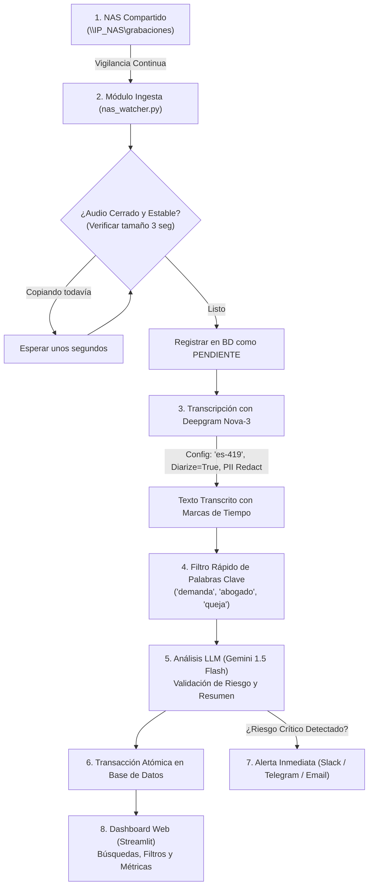

# PLAN MAESTRO: SISTEMA AUTOMATIZADO DE ANÁLISIS DE LLAMADAS
**Nombre Sugerido:** SentinelVoice / NovaAudit  
**Entorno:** NAS Empresarial + APIs Cloud de Alta Rentabilidad + Base de Datos  
**Fecha de Elaboración:** Septiembre 2026  
**Confidencialidad:** Documento de Uso Interno Exclusivo  

---

## 1. RESUMEN EJECUTIVO

El objetivo de este proyecto es construir un sistema automatizado de extremo a extremo que:
1. **Monitoree el almacenamiento NAS** de la empresa donde se guardan las grabaciones de llamadas telefónicas (con duración promedio de 40 segundos a 1 minuto).
2. **Transcriba automáticamente el audio a texto en español** utilizando el modelo **Deepgram Nova-3**, identificando quién habla (Agente vs. Cliente) y protegiendo datos sensibles (tarjetas, identificaciones) de manera nativa.
3. **Detecte palabras clave críticas** (como *"demanda"*, *"abogado"*, *"denuncia"*, *"queja"*, *"estafa"*).
4. **Analice el contexto mediante un LLM económico (Gemini 1.5 Flash o GPT-4o-mini)** para descartar falsos positivos y medir el nivel de riesgo real y la satisfacción del cliente.
5. **Almacene los datos estructurados en una Base de Datos** (SQLite / PostgreSQL) con una máquina de estados tolerante a fallos.
6. **Emita alertas inmediatas** (Telegram / Slack / Email) ante amenazas legales de clientes y ofrezca un **Dashboard Web interactivo** para auditoría y búsqueda rápida.

---

## 2. ANÁLISIS DE COSTOS Y RENTABILIDAD (ROI)

Tomando en cuenta que las llamadas duran en promedio entre **40 segundos y 1 minuto**:

| Componente | Proveedor / Modelo | Costo Unitario | Costo por 1,000 Llamadas | Características Clave |
| :--- | :--- | :--- | :--- | :--- |
| **Transcripción (STT)** | **Deepgram Nova-3** | ~$0.0043 / min | **~$3.60 USD** | • Diarización incluida (Agente vs Cliente)<br>• Keyterm Prompting (máxima precisión en "demanda")<br>• Enmascarado nativo de PII<br>• Procesa cada audio en < 800 ms |
| **Análisis Contextual (LLM)** | **Gemini 1.5 Flash** / **GPT-4o-mini** | ~$0.075 / 1M tokens | **~$0.08 USD** | • Desambiguación semántica<br>• Extracción de sentimiento y resumen<br>• Formato JSON estructurado |
| **Almacenamiento** | SQLite / PostgreSQL | $0.00 | **$0.00 USD** | Persistencia local o en servidor propio |
| **TOTAL ESTIMADO** | — | — | **~$3.68 USD** | **Menos de $0.004 USD por llamada auditada** |

> 💡 **Conclusión Financiera:** Auditar **10,000 llamadas al mes** representará un costo operativo en APIs de aproximadamente **$37 USD mensuales**, reemplazando cientos de horas de auditoría manual humana.

---

## 3. ARQUITECTURA TÉCNICA Y FLUJO DEL SISTEMA



### Paso a Paso del Flujo:
1. **Detección en el NAS:** El servicio escanea la carpeta de red. Comprueba que el archivo no esté siendo escrito en ese instante por la central telefónica (verifica estabilidad de tamaño).
2. **Registro de Estado:** Se registra en la base de datos con estado `PENDIENTE` para evitar duplicar trabajo en caso de reinicios.
3. **Transcripción con Nova-3:** Se envía el archivo a Deepgram con los siguientes parámetros:
   * `model: "nova-3"`
   * `language: "es-419"` (Español Latino) o `"es"`
   * `diarize: True` (Separa quién habla: Agente o Cliente)
   * `redact: ["pci", "ssn"]` (Oculta números de tarjetas o documentos personales)
   * `keywords: ["demanda:2.0", "abogado:2.0", "denuncia:2.0"]` (Aumento de sensibilidad acústica)
4. **Desambiguación Semántica con LLM:**
   * Si aparece la palabra *"demanda"*, el LLM analiza el contexto:
     * *Caso A (Alerta):* *"Si no me cancelan la cuenta voy a interponer una demanda civil"* ➔ Clasificación: `RIESGO_LEGAL_ALTO`.
     * *Caso B (Falso Positivo):* *"Este servicio tiene mucha demanda en el mercado"* ➔ Clasificación: `COMERCIAL_NORMAL`.
5. **Persistencia y Alerta:**
   * Se guardan los resultados, resumen, sentimiento y segundo exacto de cada coincidencia en la base de datos.
   * Si la llamada es calificada con riesgo alto, se dispara una notificación push/webhook inmediata al equipo de supervisión.

---

## 4. ESTRATEGIA: "QUE NO FALLE" (ALTA DISPONIBILIDAD Y RESILIENCIA)

Para garantizar estabilidad ininterrumpida y protección de datos:

1. **Máquina de Estados Transaccional:**
   * Cada llamada avanza por: `PENDIENTE` ➔ `TRANSFIRIENDO` ➔ `ANALIZANDO` ➔ `COMPLETADO`.
   * Si ocurre un apagón, pérdida de conexión con el NAS o error de internet, al encender nuevamente el sistema retoma únicamente las llamadas pendientes.
2. **Reintentos con Backoff Exponencial (`tenacity`):**
   * Ante micro-cortes de red o saturación de la API (códigos HTTP 429, 500, 503), el sistema reintenta automáticamente con esperas progresivas (1s, 2s, 4s, 8s).
3. **Cola de Cuarentena (Dead-Letter Queue):**
   * Si un archivo de audio está dañado o vacío, se marca en la base de datos como `ERROR_ARCHIVO_CORRUPTO` y se aísla, impidiendo que bloquee el resto de las llamadas.
4. **Protección de Datos Sensibles (Zero Data Retention):**
   * Se activan las políticas corporativas en Deepgram y Gemini/Vertex AI que garantizan que ningún audio ni texto es utilizado para entrenar modelos de IA de terceros.
   * Enmascaramiento local preventivo antes de persistir en disco.

---

## 5. MODELO DE BASE DE DATOS PROPUESTO

### Tabla `calls` (Llamadas Registradas)
* `id` (INTEGER PRIMARY KEY)
* `filename` (Nombre del archivo en el NAS)
* `nas_path` (Ruta UNC de origen)
* `duration_seconds` (Duración del audio)
* `status` (PENDIENTE, PROCESANDO, COMPLETADO, ERROR)
* `transcript` (Transcripción completa con etiquetas de hablante)
* `summary` (Resumen automático de 2 líneas generado por IA)
* `sentiment` (POSITIVO, NEUTRAL, NEGATIVO, MOLESTO)
* `risk_level` (BAJO, MEDIO, ALTO, CRÍTICO)
* `has_legal_alert` (BOOLEAN)
* `created_at` (Fecha de detección)
* `processed_at` (Fecha de finalización)

### Tabla `keyword_hits` (Palabras Clave Encontradas)
* `id` (INTEGER PRIMARY KEY)
* `call_id` (FOREIGN KEY hacia `calls.id`)
* `keyword` (Ej: "demanda", "abogado")
* `speaker` (Cliente o Agente)
* `timestamp_seconds` (Segundo exacto donde se pronunció)
* `snippet` (Frase contextual donde ocurrió)
* `is_validated_risk` (BOOLEAN validado por LLM)

---

## 6. ESTRUCTURA DEL PROYECTO (CÓDIGO MODULAR)

```
sentinel_voice/
│
├── config.py             # Configuración central (Ruta NAS, API Keys, Palabras clave)
├── database.py           # Conexión SQLite, esquemas y operaciones transaccionales
├── nas_watcher.py        # Detector y validador de archivos nuevos en el NAS
├── transcriber.py        # Cliente Deepgram Nova-3 (Diarización + PII Redact)
├── analyzer.py           # Analizador de palabras clave y LLM (Filtro 'Demanda')
├── notifier.py           # Envío de alertas (Telegram / Slack / Correo)
├── main.py               # Orquestador del pipeline automatizado (Worker)
├── dashboard.py          # Panel web interactivo con Streamlit
├── requirements.txt      # Dependencias del proyecto
├── .env.example          # Plantilla de variables de entorno seguras
├── .gitignore            # Exclusión de audios, BD local y credenciales
└── LICENSE.md            # Licencia propietaria confidencial de la empresa
```

---

## 7. CRONOGRAMA DE IMPLEMENTACIÓN RECOMENDADO

1. **Fase 1: Conexión y Motor Base (Días 1 - 2)**
   * Configuración de entorno y conexión con la carpeta de red del NAS.
   * Integración con la API de Deepgram Nova-3 para audios de prueba en español.
   * Creación de la base de datos local y tablas.
2. **Fase 2: Inteligencia y Detección de "Demanda" (Días 3 - 4)**
   * Algoritmo de desambiguación con LLM para descartar falsos positivos.
   * Generación automática de resumen y métrica de sentimiento.
   * Sistema de alertas inmediatas por webhook.
3. **Fase 3: Dashboard y Puesta en Marcha (Días 5 - 6)**
   * Dashboard con buscador de llamadas, filtro por palabra clave y reproductor.
   * Pruebas de estrés y resiliencia ante cortes de red del NAS.
